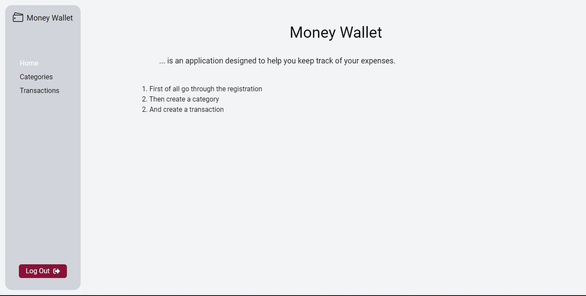
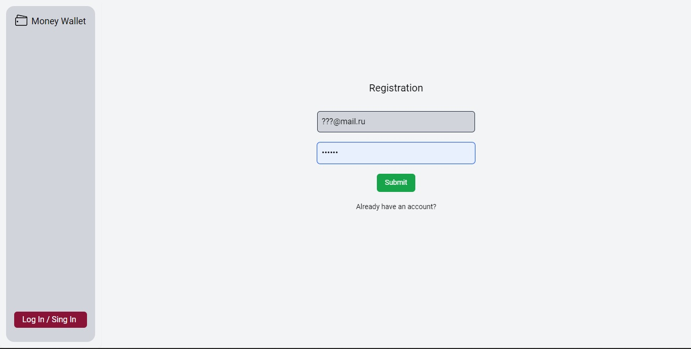
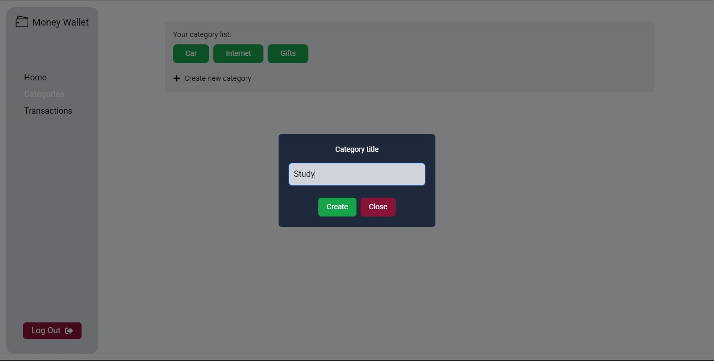
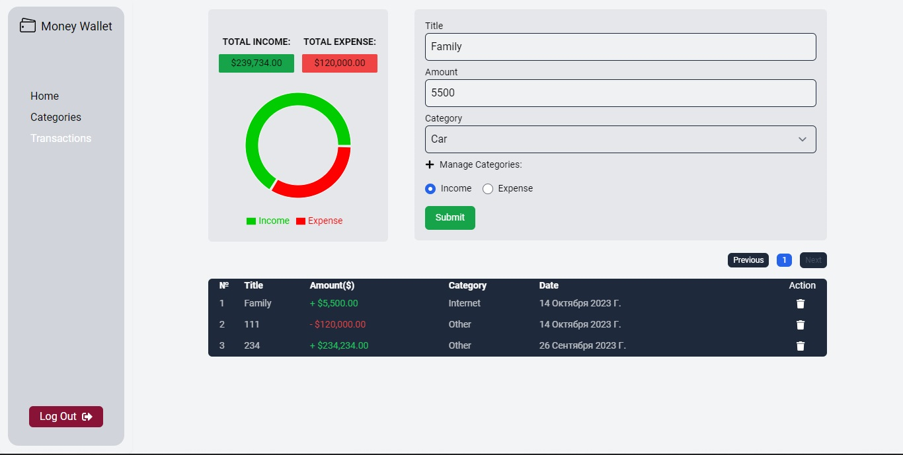

<h1 align="center">Money Wallet</h1>


<p align="center">
  


</p>

<p align="center">
   


</p>

## Description

Money Wallet - is an application created to keep records of income and expenses of funds

## Authentication

<p align="center">
   


</p>

Registration is required to use the application. Validation of forms takes place on the server side

## Categories

<p align="center">
   


</p>

In the categories section, you can create and edit income/expense categories

## Transactions

On this page you can perform an operation with income or expenses and view the total income

<p align="center">
   


</p>

## About the project

#### Frontend stack: 

- React
- TypeScript

#### Backend stack: 

- NestJS 
- TypeORM 
- PostgreSQL

## Project setup

```
npm install
npm run start
```


